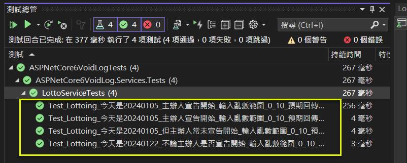

## 無回傳值方法 (void method) 的單元測試, 以 Serilog 套件為例
Unit Test for void method (Serilog package) in ASP.NET Core 6 MVC   

## 前言

接續前一篇 <a href="https://www.jasperstudy.com/2024/01/static-elements-system.html" target="_blank">樂透開獎(含日期限制)(含主辦人宣佈啟動開獎)</a> 的例子, 假設有一個新的需求:  "需要將開獎中的各次號碼及結果寫入Log記錄檔, 以供後續稽核".  

雖然 ASP.NET Core 有提供一個 ILogger 的實作, 但功能有限. (參考文件4..)  
一般會採用 Serilog 套件, 但其相關的 Log method (例如: LogTrace, LogDebug ... 等), 都沒有回傳值 (void), 無法以回傳值模擬其結果, 那應該要如何建立測試呢?  

關於 Serilog 的部份, 主要採 參考文件1..及2.. 方式進行演練及實作.  

完整範例可由 GitHub 下載.   

<!--more-->

## 演練細節

### 步驟_1: 安裝以下套件
* Serilog.AspNetCore 8.0.0: 
  * 請留意它會更新一些 ASP.NET Core 內建套件的版本. 例如: Microsoft.Extensions.DependencyInjection 由 6.0.0 --> 8.0.0   
 
```csharp
更新:

Microsoft.Extensions.DependencyInjection.6.0.0 -> 8.0.0
Microsoft.Extensions.DependencyInjection.Abstractions.6.0.0 -> 8.0.0
System.Diagnostics.DiagnosticSource.4.3.0 -> 8.0.0
System.Text.Encodings.Web.6.0.0 -> 8.0.0
System.Text.Json.6.0.0 -> 8.0.0

正在安裝:

Microsoft.Extensions.Configuration.Abstractions.8.0.0
Microsoft.Extensions.Configuration.Binder.8.0.0
Microsoft.Extensions.DependencyModel.8.0.0
Microsoft.Extensions.Diagnostics.Abstractions.8.0.0
Microsoft.Extensions.FileProviders.Abstractions.8.0.0
Microsoft.Extensions.Hosting.Abstractions.8.0.0
Microsoft.Extensions.Logging.8.0.0
Microsoft.Extensions.Logging.Abstractions.8.0.0
Microsoft.Extensions.Options.8.0.0
Microsoft.Extensions.Primitives.8.0.0
Serilog.3.1.1
Serilog.AspNetCore.8.0.0
Serilog.Extensions.Hosting.8.0.0
Serilog.Extensions.Logging.8.0.0
Serilog.Formatting.Compact.2.0.0
Serilog.Settings.Configuration.8.0.0
Serilog.Sinks.Console.5.0.0
Serilog.Sinks.Debug.2.0.0
Serilog.Sinks.File.5.0.0
```

### 步驟_2: 初始化 Serilog 

以下設定, 會同時輸出到 Console 及 File.  

```csharp
#region 初始化 Serilog 設定
// Configure Serilog
Log.Logger = new LoggerConfiguration()
    .MinimumLevel.Information()
    .MinimumLevel.Override("Microsoft.AspNetCore", LogEventLevel.Warning)
    .WriteTo.Console()
    .WriteTo.File("logs/myapp.txt", rollingInterval: RollingInterval.Day)
    .CreateLogger();
    
//The builder.Host.UseSerilog() call will redirect all log events through your Serilog pipeline.
builder.Host.UseSerilog(); 
#endregion
```

### 步驟_3: 在 LottoService 使用 Serilog 

1.. 修改建構子, 加入 ILogger<LottoService> 物件的注入.

```csharp
private readonly IRandomGenerator _randomGenerator;
private readonly IDateTimeProvider _dateTimeProvider;
private readonly IFileSystem _fileSystem;
private readonly ILogger<LottoService> _logger;

public LottoService(IRandomGenerator randomGenerator, IDateTimeProvider dateTimeProvider
				  , IFileSystem fileSystem, ILogger<LottoService> logger) 
{
	_randomGenerator = randomGenerator;
	_dateTimeProvider = dateTimeProvider;
	_fileSystem = fileSystem;
	_logger = logger;
}
```

2.. 修改 Lottoing() 方法, 加入寫至 Log 的程式段.

```csharp
public LottoViewModel Lottoing(int min, int max)
{

	var result = new LottoViewModel();
	var jsonOptions = new JsonSerializerOptions()
	{

		////中文字不編碼
		//Encoder = System.Text.Encodings.Web.JavaScriptEncoder.UnsafeRelaxedJsonEscaping,
		//允許基本拉丁英文及中日韓文字維持原字元
		Encoder = JavaScriptEncoder.Create(UnicodeRanges.BasicLatin, UnicodeRanges.CjkUnifiedIdeographs),

		//不進行換行與縮排
		WriteIndented = false,

		//字首處理小寫
		//PropertyNamingPolicy = null    //不轉小寫
		PropertyNamingPolicy = JsonNamingPolicy.CamelCase   // 轉小寫
    };

	string myJson;


	// -----------------------
	// 檢核1: 是否為每個月 5 日
	// -----------------------
	var now = _dateTimeProvider.GetCurrentTime();
	if (now.Day != 5)
	{
		result.Sponsor = string.Empty;
		result.YourNumber = -1;
		result.Message = "非每個月5日, 不開獎";

		//序列化 (by System.Text.Json) 後寫到 Log
		myJson = JsonSerializer.Serialize(result, jsonOptions);
		//#pragma warning disable CA2254 // Template should be a static expression
		//                _logger.LogCritical(myJson);
		//#pragma warning restore CA2254 // Template should be a static expression
		_logger.LogCritical("{myJson}", myJson);
		//
		return result;
	}

	// -----------------------
	// 檢核2: 主辦人員是否已按下[開始]按鈕
	// -----------------------
	// 註: 這裡有可能會出現一些 Exception, 例如: FileNotFoundException
	var sponsor = string.Empty;
	try
	{
		sponsor = _fileSystem.File.ReadAllText("Extras/startup.txt");
	}
	catch (Exception)
	{
		result.Sponsor = sponsor;
		result.YourNumber = -2;
		result.Message = "主辦人員尚未按下[開始]按鈕";

		//序列化 (by System.Text.Json) 後寫到 Log
		myJson = JsonSerializer.Serialize(result, jsonOptions);
		_logger.LogError("{myJson}", myJson);
		//
		return result;
	}

	// Random(min, max): 含下界, 不含上界
	var yourNumber = _randomGenerator.Next(min, max);
	// 只要餘數是 9, 就代表中獎
	var message = (yourNumber % 10 == 9) ? "恭喜中獎" : "再接再厲";
	result.Sponsor = sponsor;
	result.YourNumber = yourNumber;
	result.Message = message;

	//序列化 (by System.Text.Json) 後寫到 Log
	myJson = JsonSerializer.Serialize(result, jsonOptions);
	_logger.LogInformation("{myJson}", myJson);
	//
	return result;
}
```

### 步驟_4: 修改原有的測試案例

1.. 因為 LottoService 的建構子增加了 ILogger&lt;LottoService&gt; 這個參數, 所以, 原有的測試案例, 也要跟著改, 不然會編譯失敗.  

2.. 因為 LogTrace, LogDebug, ... 沒有回傳值, 所以, 只能用被呼叫的次數作為驗證的指標.  

3.. 注意: LogInformation() 是擴充方法, 不能直接 Verify !   

```csharp
[TestMethod()]
public void Test_Lottoing_今天是20240105_主辦人宣告開始_輸入亂數範圍_0_10_預期回傳_9_恭喜中獎()
{
	// Arrange
	var expected = new LottoViewModel()
	{ Sponsor = "傑士伯", YourNumber = 9, Message = "恭喜中獎" }
				.ToExpectedObject();

	int fixedValue = 9;
	DateTime today = new(2024, 01, 05);
	var mockRandomGenerator = new Mock<IRandomGenerator>();
	var mockDateTimeProvider = new Mock<IDateTimeProvider>();
	mockRandomGenerator.Setup(r => r.Next(It.IsAny<int>(), It.IsAny<int>())).Returns(fixedValue);
	mockDateTimeProvider.Setup(d => d.GetCurrentTime()).Returns(today);
	// [檔案系統]
	var mockFileSystem = new MockFileSystem(new Dictionary<string, MockFileData>
		{
			{ @"Extras/startup.txt", new MockFileData("傑士伯") },
		}
	);
	// [Logger]
	var mockLogger = new Mock<ILogger<LottoService>>();

	// Act
	var target = new LottoService(mockRandomGenerator.Object, mockDateTimeProvider.Object, mockFileSystem, mockLogger.Object);
	var actual = target.Lottoing(0, 10);

	// Assert
	//---------------
	//LogInformation() 是擴充方法, 不能直接 Verify ! 
	//---------------
	//mockLogger.Verify(x => x.LogInformation(It.IsAny<string>()), Times.Once());

	mockLogger.Verify(
		x => x.Log(
			LogLevel.Information, // Match the log level
			It.IsAny<EventId>(), // Use It.IsAny for EventId
			It.Is<It.IsAnyType>((v, t) => true), // Match any log message
			It.IsAny<Exception?>(), // Use It.IsAny for Exception (nullable)
			It.IsAny<Func<It.IsAnyType, Exception?, string>>() // Use It.IsAny for the message formatter Func (nullable)
		),
		Times.Once);

	expected.ShouldEqual(actual);
}
```

```csharp
[TestMethod()]
public void Test_Lottoing_今天是20240105_主辦人宣告開始_輸入亂數範圍_0_10_預期回傳_1_再接再厲()
{
	// Arrange
	var expected = new LottoViewModel()
	{ Sponsor="傑士伯", YourNumber = 1, Message = "再接再厲" }
				.ToExpectedObject();

	int fixedValue = 1;
	DateTime today = new(2024, 01, 05);
	var mockRandomGenerator = new Mock<IRandomGenerator>();
	var mockDateTimeProvider = new Mock<IDateTimeProvider>();
	mockRandomGenerator.Setup(r => r.Next(It.IsAny<int>(), It.IsAny<int>())).Returns(fixedValue);
	mockDateTimeProvider.Setup(d => d.GetCurrentTime()).Returns(today);
	// [檔案系統]
	var mockFileSystem = new MockFileSystem(new Dictionary<string, MockFileData>
		{
			{ @"Extras/startup.txt", new MockFileData("傑士伯") },
		}
	);
	// [Logger]
	var mockLogger = new Mock<ILogger<LottoService>>();

	// Act
	var target = new LottoService(mockRandomGenerator.Object, mockDateTimeProvider.Object, mockFileSystem, mockLogger.Object);
	var actual = target.Lottoing(0, 10);

	// Assert
	mockLogger.Verify(
		x => x.Log(
			LogLevel.Information, // Match the log level
			It.IsAny<EventId>(), // Use It.IsAny for EventId
			It.Is<It.IsAnyType>((v, t) => true), // Match any log message
			It.IsAny<Exception?>(), // Use It.IsAny for Exception (nullable)
			It.IsAny<Func<It.IsAnyType, Exception?, string>>() // Use It.IsAny for the message formatter Func (nullable)
		),
		Times.Once);
	expected.ShouldEqual(actual);
}
```

```csharp
[TestMethod()]
public void Test_Lottoing_今天是20240122_不論主辦人是否宣告開始_輸入亂數範圍_0_10_預期回傳_負1_非每個月5日_不開獎()
{
	// Arrange
	var expected = new LottoViewModel()
	{ Sponsor = "", YourNumber = -1, Message = "非每個月5日, 不開獎" }
				.ToExpectedObject();

	int fixedValue = 9;
	DateTime today = new(2024, 01, 22);
	var mockRandomGenerator = new Mock<IRandomGenerator>();
	var mockDateTimeProvider = new Mock<IDateTimeProvider>();
	mockRandomGenerator.Setup(r => r.Next(It.IsAny<int>(), It.IsAny<int>())).Returns(fixedValue);
	mockDateTimeProvider.Setup(d => d.GetCurrentTime()).Returns(today);
	// [檔案系統]
	var mockFileSystem = new MockFileSystem(new Dictionary<string, MockFileData>
		{
			{ @"Extras/startup.txt", new MockFileData("傑士伯") },
		}
	);
	// [Logger]
	var mockLogger = new Mock<ILogger<LottoService>>();

	// Act
	var target = new LottoService(mockRandomGenerator.Object, mockDateTimeProvider.Object, mockFileSystem, mockLogger.Object);
	var actual = target.Lottoing(0, 10);

	// Assert
	mockLogger.Verify(
		x => x.Log(
			LogLevel.Critical, // Match the log level
			It.IsAny<EventId>(), // Use It.IsAny for EventId
			It.Is<It.IsAnyType>((v, t) => true), // Match any log message
			It.IsAny<Exception?>(), // Use It.IsAny for Exception (nullable)
			It.IsAny<Func<It.IsAnyType, Exception?, string>>() // Use It.IsAny for the message formatter Func (nullable)
		),
		Times.Once);
	expected.ShouldEqual(actual);
}
``` 

```csharp
[TestMethod()]
public void Test_Lottoing_今天是20240105_但主辦人常未宣告開始_輸入亂數範圍_0_10_預期回傳_負2_主辦人員尚未按下開始按鈕()
{
	// Arrange
	var expected = new LottoViewModel()
	{ Sponsor = "", YourNumber = -2, Message = "主辦人員尚未按下[開始]按鈕" }
				.ToExpectedObject();

	int fixedValue = 1;
	DateTime today = new(2024, 01, 05);
	var mockRandomGenerator = new Mock<IRandomGenerator>();
	var mockDateTimeProvider = new Mock<IDateTimeProvider>();
	mockRandomGenerator.Setup(r => r.Next(It.IsAny<int>(), It.IsAny<int>())).Returns(fixedValue);
	mockDateTimeProvider.Setup(d => d.GetCurrentTime()).Returns(today);
	// [檔案系統]
	var mockFileSystem = new MockFileSystem(new Dictionary<string, MockFileData>
		{
			//只要不提供檔案路徑, 就會視為 FileNotFound Exception
			//{ @"startup.txt", new MockFileData("傑士伯") },
		}
	);
	// [Logger]
	var mockLogger = new Mock<ILogger<LottoService>>();

	// Act
	var target = new LottoService(mockRandomGenerator.Object, mockDateTimeProvider.Object, mockFileSystem, mockLogger.Object);
	var actual = target.Lottoing(0, 10);

	// Assert
	mockLogger.Verify(
		x => x.Log(
			LogLevel.Error, // Match the log level
			It.IsAny<EventId>(), // Use It.IsAny for EventId
			It.Is<It.IsAnyType>((v, t) => true), // Match any log message
			It.IsAny<Exception?>(), // Use It.IsAny for Exception (nullable)
			It.IsAny<Func<It.IsAnyType, Exception?, string>>() // Use It.IsAny for the message formatter Func (nullable)
		),
		Times.Once);
	expected.ShouldEqual(actual);
}
```

### 步驟_5: 檢查式執行的結果
  

### 步驟_6: 檢查測試的結果
  

## 結論

Serilog 為 ASP.NET Core 6 的常用套件, 故本篇以此為標的, 進行演練.  

過程中遇到了一些狀況, 但也算有收穫.  
1.. LogTrace, LogDebug ... 為 extension method, 不能直接 Verify, 必須改用其實體的 Log() 方法作為 Verify 的對象.  
2.. 輸出至 Log 的中文字會被編碼, 主要原因為於 JSON 序列化時, 預設會編碼, 必須透過 json options, 指定不進行編碼.  

## 參考文件

* <a href="https://blog.miniasp.com/post/2021/11/29/How-to-use-Serilog-with-NET-6" target="_blank">1.. (Will保哥) .NET 6.0 如何使用 Serilog 對應用程式事件進行結構化紀錄</a>  
* <a href="https://gist.github.com/doggy8088/32f7c179f06ab0616b2e32728f734c5b" target="_blank">2.. (Will保哥) Serilog 與 ASP.NET Core 6.0 範例</a>  
* <a href="https://www.c-sharpcorner.com/article/how-to-implement-serilog-in-asp-net-core-web-api/" target="_blank">3.. (C# Cornor) How To Implement Serilog In ASP.NET Core Web API</a>  
* <a href="https://github.com/serilog/serilog-aspnetcore" target="_blank">4.. (GitHub) Serilog.AspNetCore 原始程式碼</a>  
* <a href="https://learn.microsoft.com/en-us/aspnet/core/fundamentals/logging/?view=aspnetcore-6.0" target="_blank">5.. (Microsoft Learn) Logging in .NET Core and ASP.NET Core</a>  
> The default ASP.NET Core web app templates:
> Use the Generic Host.
> Call WebApplication.CreateBuilder, which adds the following logging providers:
> * Console
> * Debug
> * EventSource
> * EventLog: Windows only
* <a href="https://learn.microsoft.com/en-us/aspnet/core/fundamentals/host/generic-host?view=aspnetcore-6.0" target="_blank">6.. (Microsoft Learn) .NET Generic Host in ASP.NET Core</a>  
> A host is an object that encapsulates an app's resources, such as:
> * Dependency injection (DI)
> * Logging
> * Configuration
> * IHostedService implementations
* <a href="https://stackoverflow.com/questions/70955861/the-logging-message-template-should-not-vary-between-calls-ca2254-when-only-pa" target="_blank">6.. (StackOverflow) The logging message template should not vary between calls (CA2254) when only passing on variables</a>  
* <a href="https://stackoverflow.com/questions/66307477/how-to-verify-iloggert-log-extension-method-has-been-called-using-moq" target="_blank">7.. (StackOverflow) How to verify ILogger<T>.Log extension method has been called using Moq?</a>  
```csharp
// You need to verify like this
_loggerMock.Verify(logger => logger.Log(
        It.Is<LogLevel>(logLevel => logLevel == LogLevel.Error),
        It.Is<EventId>(eventId => eventId.Id == 0),
        It.Is<It.IsAnyType>((@object, @type) => @object.ToString() == "myMessage" && @type.Name == "FormattedLogValues"),
        It.IsAny<Exception>(),
        It.IsAny<Func<It.IsAnyType, Exception, string>>()),
    Times.Once);
```

* <a href="https://rainmakerho.github.io/2022/07/09/aspnet6-custom-logger/" target="_blank">8.. (亂馬客) ASP.NET Core 6 實作 Logger</a>  

* <a href="https://blog.darkthread.net/blog/aspnet-core-json-setting/" target="_blank">9.. (黑暗執行緒) ASP.NET Core JSON 中文編碼問題與序列化參數設定</a>  
> 這篇所述的作法, 只適用在 Controller; 若為 Service, 要自己寫.  

